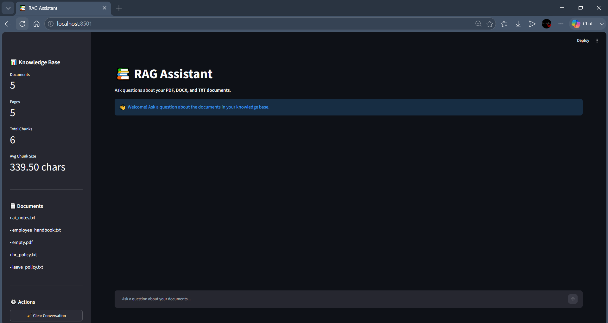
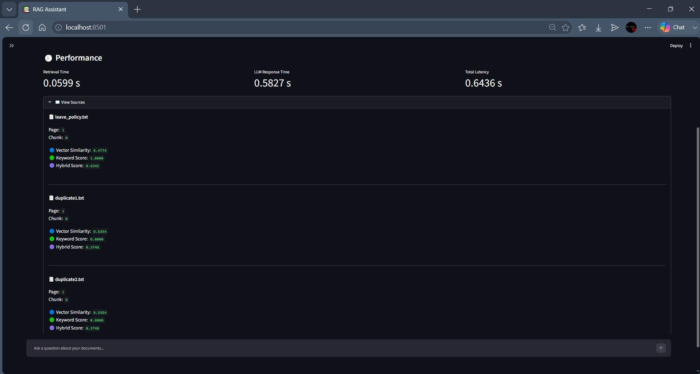
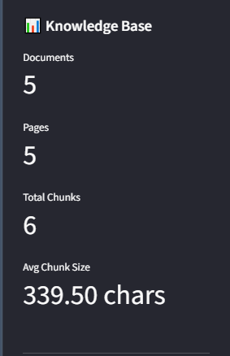
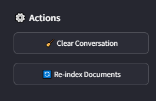

# RAG AI Assistant

## 1. Project Overview

The **RAG AI Assistant** is a Retrieval-Augmented Generation (RAG) knowledge assistant that allows users to ask questions based on information available in uploaded documents.

The application supports **PDF, DOCX, and TXT** documents. Documents are loaded, split into chunks, converted into embeddings, and stored in ChromaDB.

When a user asks a question, the question is converted into an embedding and relevant document chunks are retrieved. The retrieved context is then passed to the language model to generate an answer.

The application provides a **ChatGPT-style Streamlit interface** with document statistics, conversation controls, confidence levels, and source information.

---

## 2. Folder Structure

```text
RAG-Assistant/
│
├── app.py
├── ui.py
├── chatbot.py
├── chunker.py
├── config.py
├── document_loader.py
├── embeddings.py
├── logger.py
├── prompts.py
├── retriever.py
├── utils.py
│
├── requirements.txt
├── README.md
├── TEST_REPORT.md
├── .gitignore
├── .env
│
├── data/
│   ├── AI_Notes.txt
│   ├── HR_Policy.txt
│   ├── Employee_Handbook.txt
│   ├── Leave_Policy.txt
│   ├── empty.pdf
│   └── corrupted.pdf
|   └── test.csv
│
└── chroma_db/
```

---

## 3. Setup Instructions

### Step 1: Clone the Repository

```bash
git clone <YOUR_GITHUB_REPOSITORY_URL>
cd RAG-Assistant
```

### Step 2: Create Virtual Environment

```bash
python -m venv venv
```

### Step 3: Activate Virtual Environment

For Windows:

```powershell
venv\Scripts\activate
```

### Step 4: Install Required Packages

```powershell
pip install -r requirements.txt
```

### Step 5: Configure Environment Variables

Create a `.env` file in the project directory.

Add:

```env
GROQ_API_KEY=your_GROQ_API_KEY_token_here
```

Do not expose or commit the real token.

### Step 6: Add Documents

Place PDF, DOCX, and TXT documents inside the `data` folder.

### Step 7: Run the Application

```powershell
streamlit run app.py
```

### Step 8: Open the Application

Open the following address in your browser:

```text
http://localhost:8501
```

---

## 4. Screenshots

### RAG Assistant Interface

The application provides a ChatGPT-style interface for asking questions about the documents available in the knowledge base.



### Question and Answer

The application displays the user's question, generated answer, confidence level, and performance metrics such as retrieval time, LLM response time, and total latency.


### Sources and Hybrid Search

The application displays the retrieved document sources along with page number, chunk number, vector similarity, keyword score, and hybrid score.



### Document Statistics

The sidebar displays the knowledge-base statistics, including:

- Total Documents
- Total Pages
- Total Chunks
- Average Chunk Size



### Actions

The application provides the following actions:

- Clear Conversation
- Re-index Documents


---

## 5. Known Limitations

1. Corrupted or invalid documents cannot be processed.
2. Empty documents may generate zero chunks.
3. Scanned PDFs may require OCR for accurate text extraction.
4. Very large documents can take more time to process and generate embeddings.
5. Duplicate documents may create duplicate chunks.
6. Answer quality depends on the quality of document text and retrieved chunks.
7. Questions unrelated to the uploaded documents may return a low-confidence response.
8. The current application supports PDF, DOCX, and TXT document formats.
9. The application requires the configured embedding model and language model to be available.
10. The current confidence score is based on retrieval distance thresholds.

---

## 6. Future Improvements

1. Add OCR support for scanned PDF documents.
2. Implement automatic duplicate document detection.
3. Add support for additional document formats.
4. Improve the confidence scoring mechanism.
5. Add conversation memory.
6. Add user authentication and access control.
7. Allow users to upload documents directly through the UI.
8. Add document deletion and document management features.
9. Improve source citation with better page-level navigation.
10. Improve retrieval accuracy using advanced retrieval techniques.
11. Add multilingual document and question support.
12. Deploy the RAG Assistant to a cloud platform.
